# cybersecurity journey

**Topic:** The Foundations

## 🔐 Cybersecurity – Definition

Cybersecurity is the practice of protecting computer systems, networks, and data from unauthorized access, attacks, damage, or disruption.  
It involves using technologies, processes, and best practices to ensure **confidentiality, integrity, and availability** of information.

# Benefits of Cybersecurity

Cybersecurity is essential in protecting digital systems, data, and networks. Its benefits include:

## 1. Protection of Sensitive Data

- Safeguards personal, financial, and business information.
- Prevents data breaches and identity theft.

## 2. Maintains Business Continuity

- Reduces downtime caused by cyber attacks.
- Ensures smooth operations of critical systems.

## 3. Prevents Financial Loss

- Protects against cyber fraud and ransomware.
- Avoids the costs associated with data breaches and recovery.

## 4. Enhances Customer Trust

- Demonstrates commitment to data privacy and security.
- Builds confidence among clients and stakeholders.

## 5. Compliance with Regulations

- Helps meet legal and industry standards (e.g., GDPR, HIPAA).
- Avoids penalties and legal issues.

## 6. Protection Against Cyber Threats

- Guards against malware, phishing, and hacking attempts.
- Reduces the risk of system compromise.

## 7. Safeguards Reputation

- Prevents damage to brand image caused by breaches.
- Maintains public and stakeholder trust.

## 8. Encourages Safe Digital Practices

- Promotes awareness and training for employees.
- Helps users follow security best practices.

## 🧠 CIA Triad Explained with Examples

| Principle | Definition | Real-World Example |
|--------|-----------|------------------|
| Confidentiality | Prevents unauthorized access to data | HTTPS, Passwords, VPN |
| Integrity | Prevents unauthorized modification of data | Hashing, Git commits |
| Availability | Ensures systems remain online | Cloud redundancy, Load balancers |

```mermaid
graph TD
    CIA["🔐 The CIA Triad"]

    C["🔒 Confidentiality<br/>Keeping Data Secret"]
    I["🧾 Integrity<br/>Ensuring Data is Accurate"]
    A["⚡ Availability<br/>Ensuring Systems are Up"]

    CIA --> C
    CIA --> I
    CIA --> A

    style CIA fill:#1f2937,stroke:#ffffff,color:#ffffff,stroke-width:2px
    style C fill:#2563eb,color:#ffffff
    style I fill:#059669,color:#ffffff
    style A fill:#dc2626,color:#ffffff

```

